# The Style Studio

A full-stack online fashion store for clothes, jewellery, bags, toys and accessories. Shoppers can browse and search the catalogue, fill a bag and check out with simulated payments. Admins manage products, categories, orders and users from a dedicated panel.

**[Live site](https://vogue-cart-iota.vercel.app)** · **[Try the admin panel (read-only demo)](https://vogue-cart-iota.vercel.app/admin/demo)**

> Hosted on a free plan, so the first page load can take a few seconds.

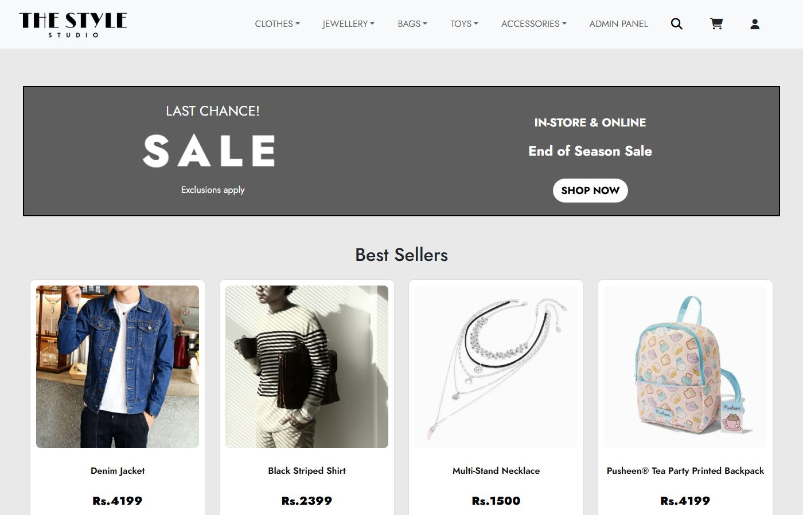

## Features

**Store**
- Five product categories with sorting by price or name
- Search in the navbar that matches partial product names
- Best sellers ranked from real order data
- Product pages with descriptions and breadcrumbs
- Shopping bag with quantity controls and an order summary
- Checkout with delivery details and three payment options: cash on delivery, card, and JazzCash or Easypaisa mobile wallets
- Order confirmation page with the order number, items and payment status
- Customer sign-up and sign-in
- Responsive layout for phones, tablets and desktops

**Admin panel**
- Dashboard with revenue, order, product and user totals, recent orders and best sellers
- Add, edit and delete products with image upload and preview
- Manage categories, with protection against deleting a category that still has products
- View orders, filter them by payment status, and see a summary for each user
- Every admin page requires a login
- A read-only demo account lets visitors explore the panel without changing anything, with customer names, phone numbers and addresses masked

> **Payments are simulated.** No real money changes hands. Card details never leave the browser; only the card brand and last four digits are stored. To try it, use the test card `4242 4242 4242 4242` with any future expiry date and any 3-digit CVC. `4000 0000 0000 0002` shows a declined card.

## Screenshots

### Store

| Category page | Product page |
|---|---|
| 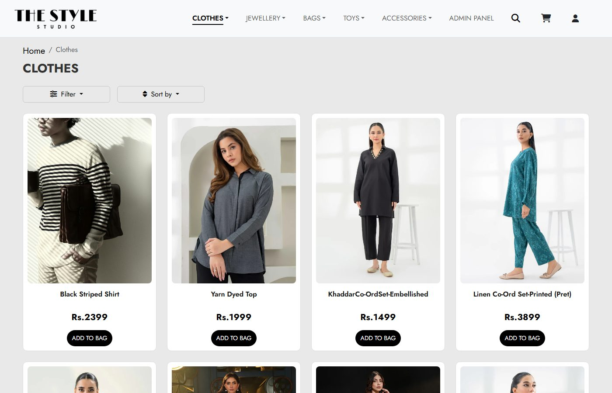 | 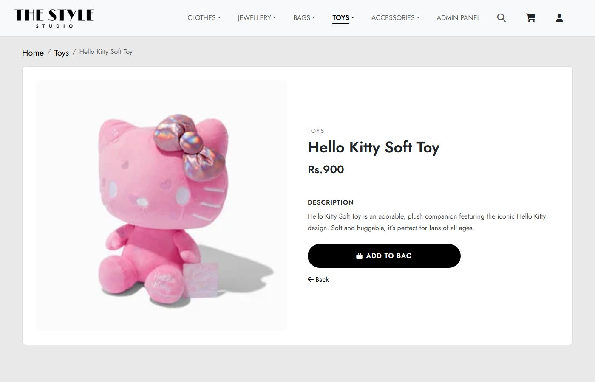 |
| **Search** | **Shopping bag** |
| 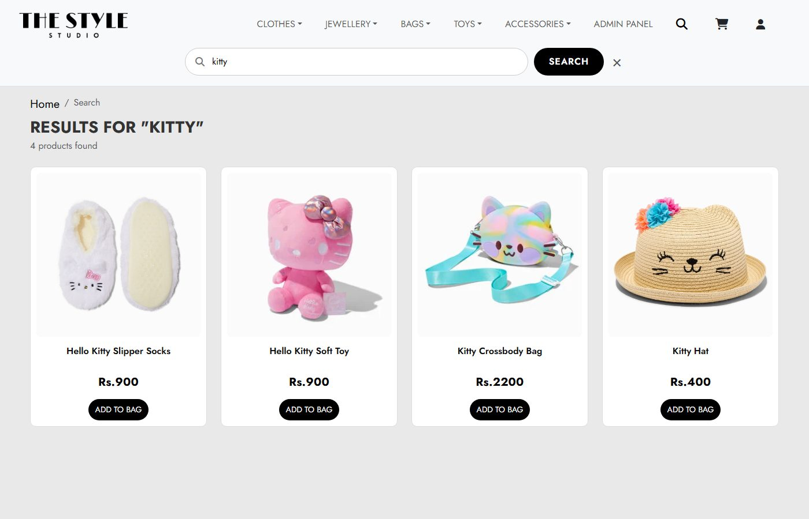 | 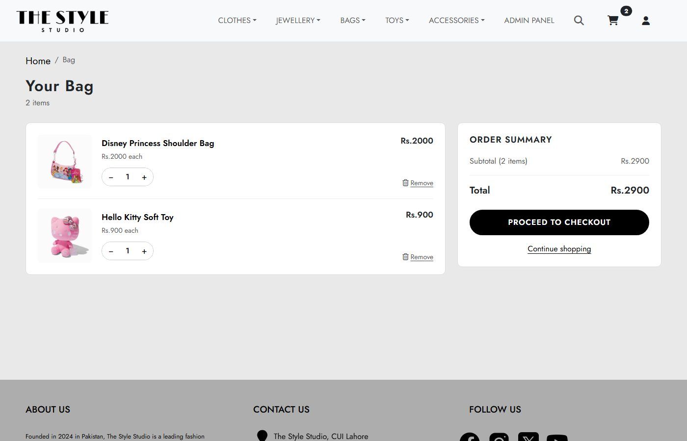 |
| **Checkout** | **Order confirmation** |
| 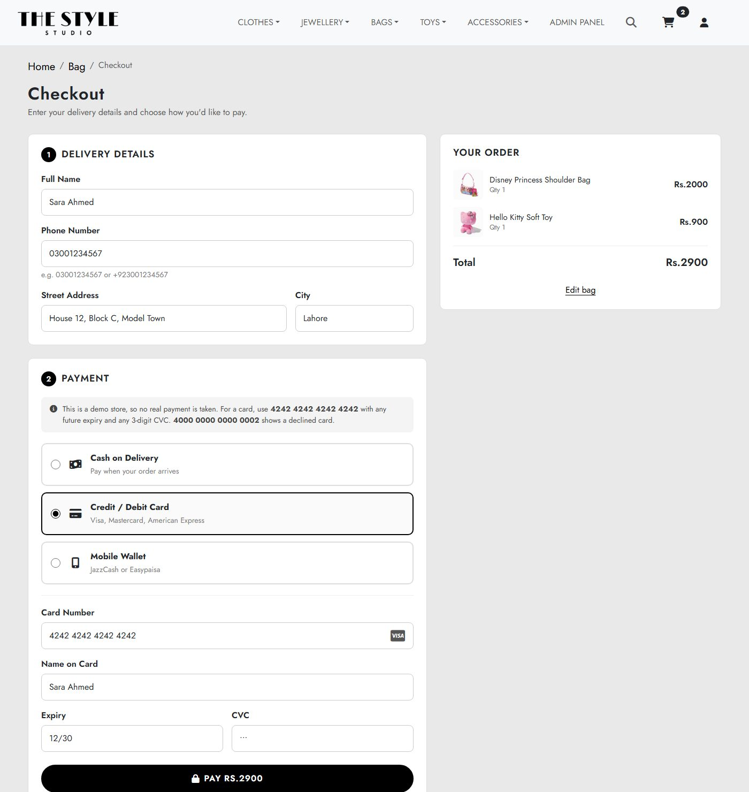 | 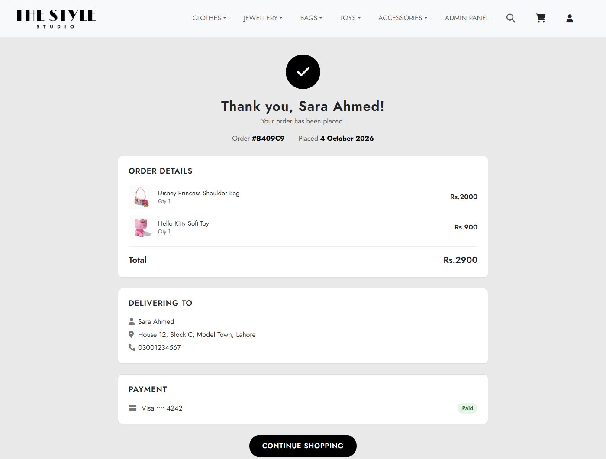 |

### Admin panel

| Dashboard | Products |
|---|---|
| 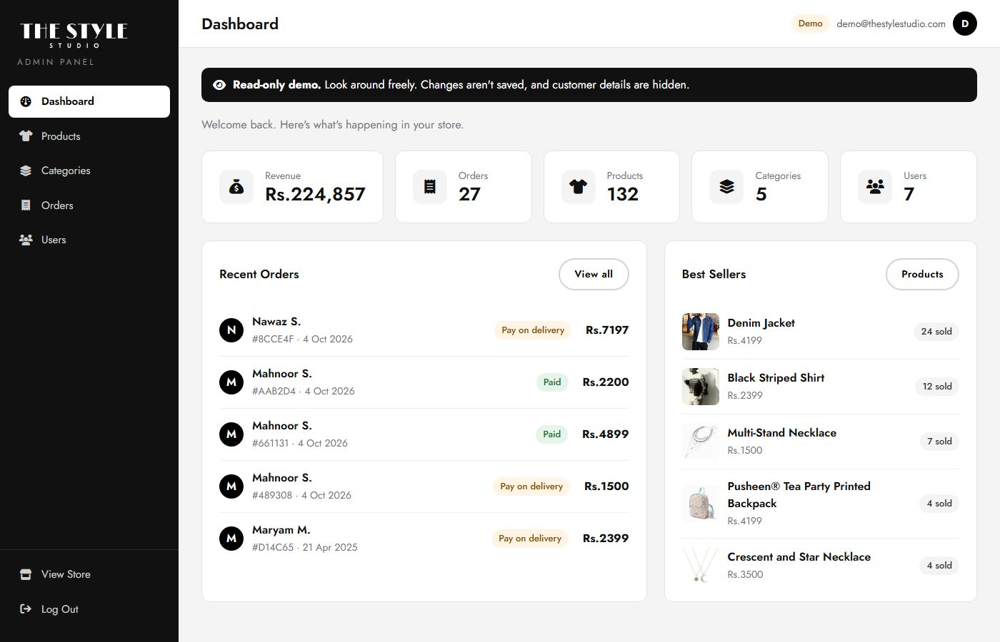 | 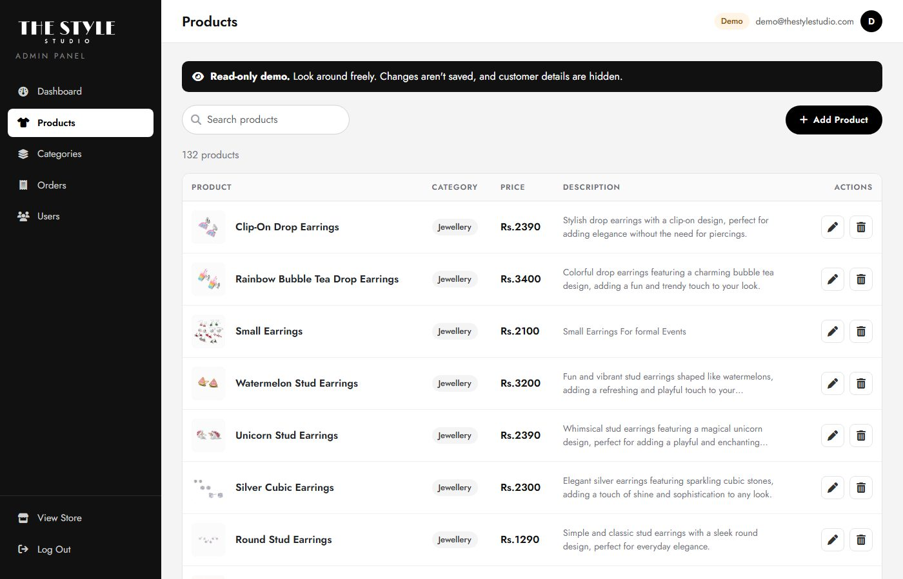 |
| **Orders** | **Edit product** |
| 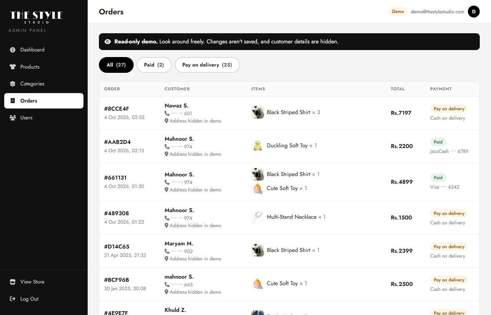 | 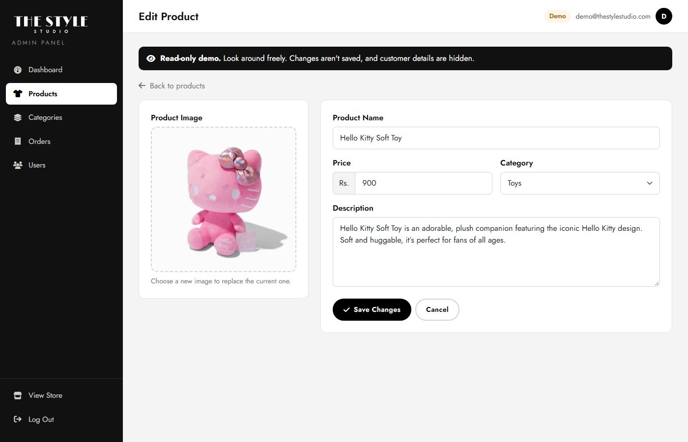 |

### Mobile

<p>
  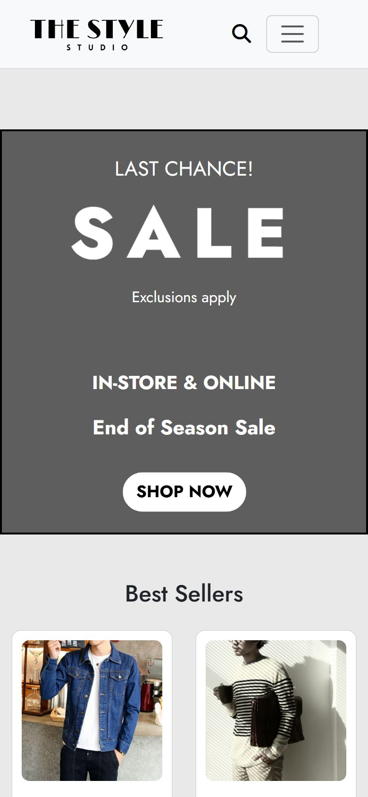
  &nbsp;
  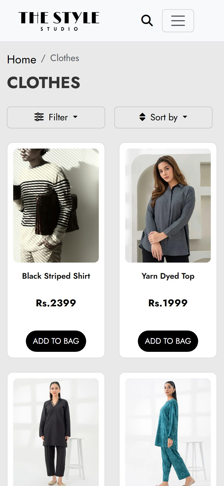
</p>

## Tech stack

| Area | Technology |
|---|---|
| Server | Node.js, Express |
| Pages | EJS templates with express-ejs-layouts, Bootstrap 5, Font Awesome |
| Database | MongoDB Atlas with Mongoose |
| Sessions | express-session stored in MongoDB (connect-mongo) |
| Auth | bcrypt password hashing |
| Image uploads | Multer, with Cloudinary storage in production |
| Hosting | Vercel |

## Running it locally

**You'll need** Node.js 18 or later and a MongoDB database. A free [MongoDB Atlas](https://www.mongodb.com/atlas) cluster works.

1. Clone the repository and install the dependencies:
   ```bash
   git clone https://github.com/MahnoorSaleha28/VogueCart.git
   cd VogueCart/TheStyleStudio
   npm install
   ```
2. Create a `.env` file in the **repository root**, next to the `TheStyleStudio` folder:
   ```env
   MONGODB_URI=mongodb+srv://<user>:<password>@<cluster>.mongodb.net/<database>
   SESSION_SECRET=any-long-random-string

   # Optional locally: without these, uploaded images are saved to public/images
   CLOUDINARY_CLOUD_NAME=
   CLOUDINARY_API_KEY=
   CLOUDINARY_API_SECRET=
   ```
3. Create an admin account:
   ```bash
   node scripts/addAdmin.js you@example.com <password>
   ```
   To create the read-only demo account that the "View Read-Only Demo" button signs in to, run:
   ```bash
   node scripts/addAdmin.js demo@example.com --demo
   ```
4. Start the server:
   ```bash
   npm run dev     # restarts on changes (nodemon)
   # or
   npm start
   ```
5. Open [http://localhost:5000](http://localhost:5000). The admin panel is at [http://localhost:5000/admin/login](http://localhost:5000/admin/login).

## Deploying to Vercel

1. Import the repository on [Vercel](https://vercel.com) and set **Root Directory** to `TheStyleStudio`.
2. Add `MONGODB_URI`, `SESSION_SECRET` and the three `CLOUDINARY_*` variables under **Environment Variables**. Vercel's file system is read-only, so admin image uploads need Cloudinary there.
3. In MongoDB Atlas, go to **Network Access** and allow connections from anywhere (`0.0.0.0/0`), since Vercel doesn't use fixed IP addresses.
4. Deploy. Every push to `main` redeploys the site.

The project's `vercel.json` makes sure the page templates are bundled with the server function, and leaves out `public/` because Vercel serves those files from its CDN.

## Project structure

```
TheStyleStudio/
├── server.js            # App setup, homepage and admin login routes
├── routes/
│   ├── user/            # Categories, search, product pages, bag, checkout, accounts
│   └── admin/           # Dashboard, products, categories, orders, users
├── models/              # Mongoose models: Product, Category, Order, User, Admin
├── views/               # EJS pages and layouts (admin pages in views/admin)
├── public/              # CSS and product images
├── middlewares/         # Admin login check and flash messages
├── utils/               # Image uploads and demo-mode data masking
└── scripts/addAdmin.js  # Creates admin and demo accounts
```
